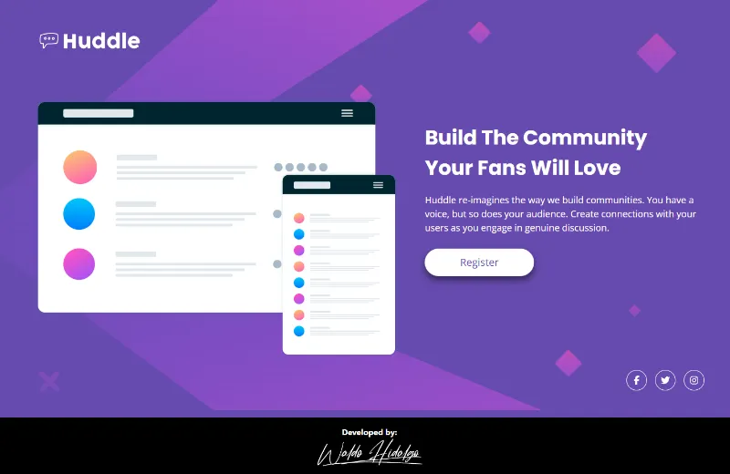

# Huddle landing page with single introductory section

Repositorio con el código solución al challenge: [Huddle landing page with single introductory section challenge on Frontend Mentor](https://www.frontendmentor.io/challenges/huddle-landing-page-with-a-single-introductory-section-B_2Wvxgi0).

## Tabla de Contenidos

- [Huddle landing page with single introductory section](#huddle-landing-page-with-single-introductory-section)
  - [Tabla de Contenidos](#tabla-de-contenidos)
  - [Challenge](#challenge)
  - [Diseños a Replicar](#diseños-a-replicar)
    - [1- Mobile Design](#1--mobile-design)
    - [2- Desktop Design](#2--desktop-design)
    - [3- Active States Design](#3--active-states-design)
  - [Proyecto Realizado](#proyecto-realizado)
    - [1- Mobile Size](#1--mobile-size)
    - [2- Desktop Size](#2--desktop-size)
    - [3- Active States](#3--active-states)

## Challenge

El challenge consiste en realizar lo siguiente:

> Users should be able to:
>
> - View the optimal layout for the page depending on their device's screen size
> - See hover states for all interactive elements on the page

## Diseños a Replicar

### 1- Mobile Design

### 2- Desktop Design

### 3- Active States Design

## Proyecto Realizado

### 1- Mobile Size

### 2- Desktop Size

### 3- Active States

